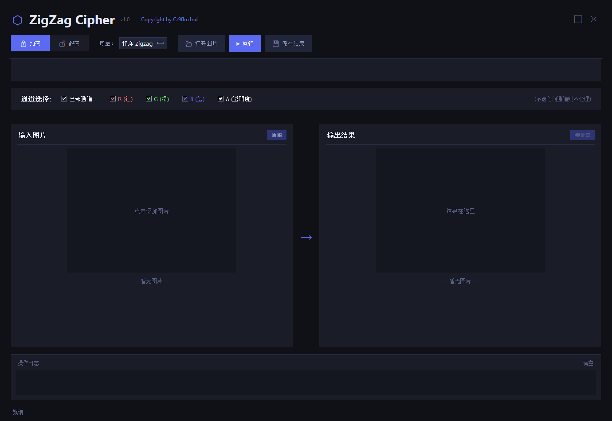
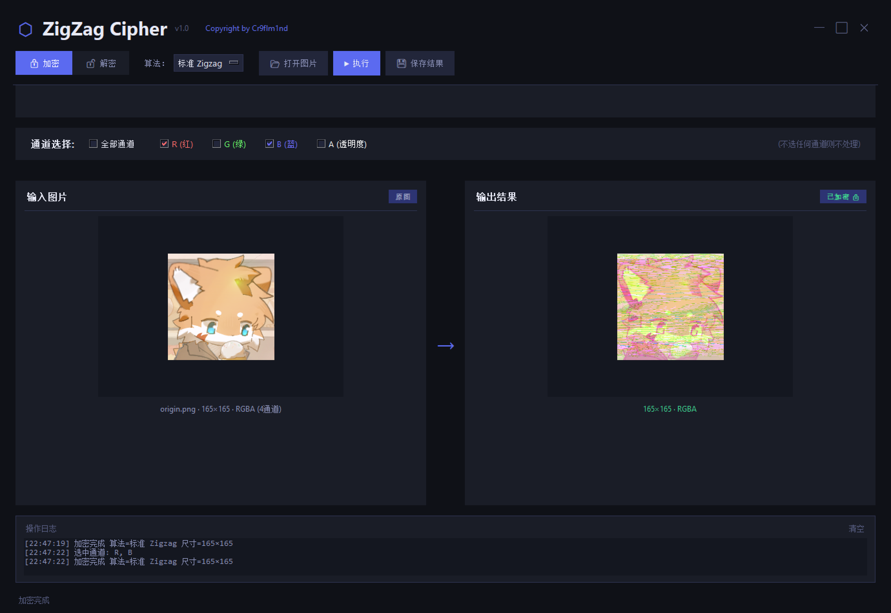
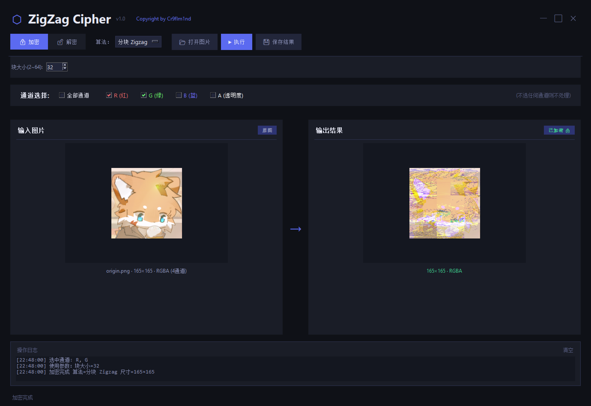
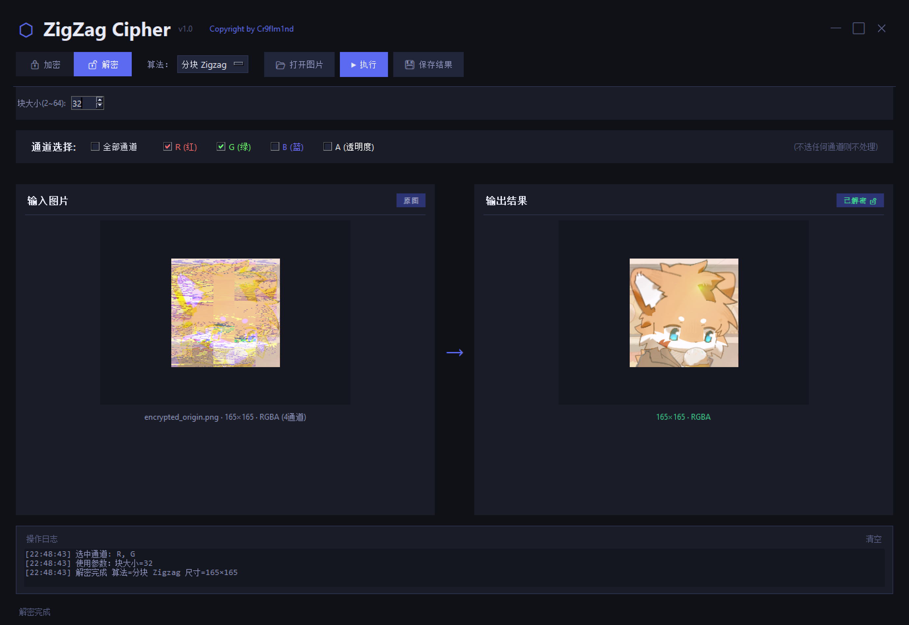
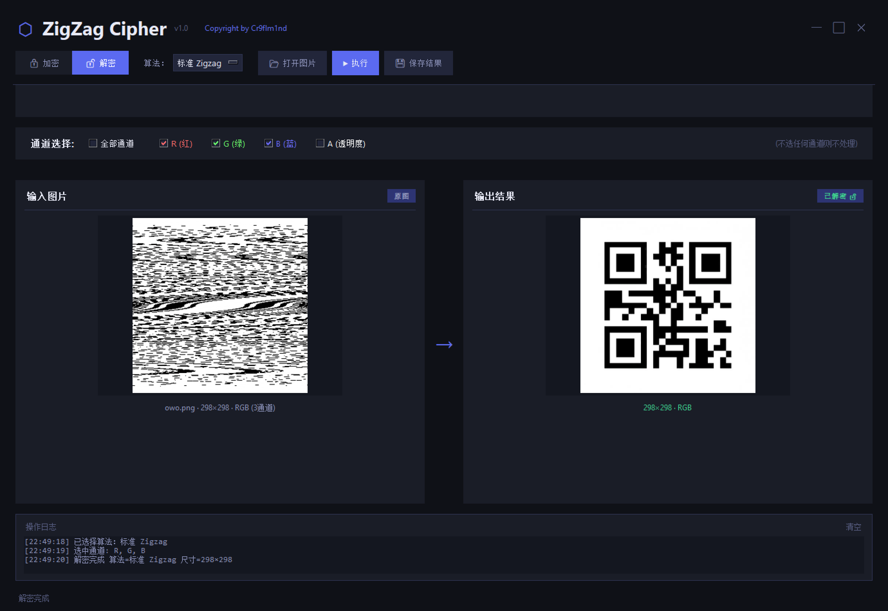

# ZigZag Cipher: The tool for CTF Misc
> 如果可以的话，求一个Star⭐喵\~  
> 谢谢nwn喵呜~

这是一款拥有多种 ZigZag 变式的开源CTF Misc GUI工具。

主程序只有一个文件，使用Tkinter实现GUI，使用大模型完成了大部分工作。

目前该工具支持以下 ZigZag 变式：
- 标准 ZigZag
- 反向 ZigZag
- 外螺旋 ZigZag
- 内螺旋 ZigZag
- 对角线 ZigZag
- 多级 ZigZag
- 分块 ZigZag
- 蛇形 ZigZag
- ZigZag + XOR
- 转置 ZigZag
- RGBA 单通道 ZigZag

在正式使用之前您可能需要安装：
```cmd
pip install numpy Pillow
```
或者你可以使用提供的requirements.txt:
```cmd
pip install -r requirements.txt
```

# 主界面


# 运行截图




